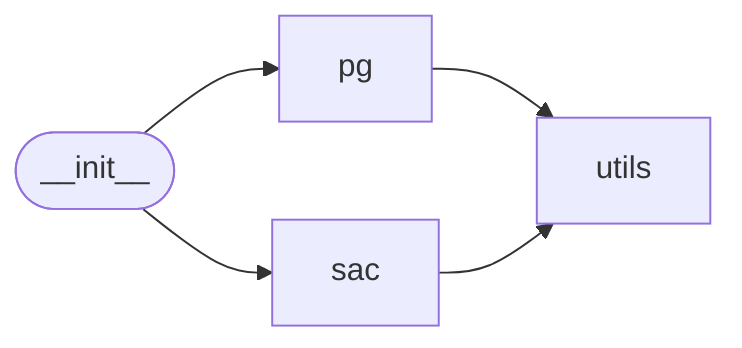

# Code Overview

[_Documentation generated by Documatic_](https://www.documatic.com)

<!---Documatic-section-Codebase Structure Python-start--->
## Codebase Structure Python

The codebase has a single-depth folder structure,
                with 16 code files in total.

<!---Documatic-block-system_architecture-start--->

<!---Documatic-block-system_architecture-end--->

# #
<!---Documatic-section-Codebase Structure Python-end--->

<!---Documatic-section-Key Objects-start--->
## Key Objects

There are exposed imports at level-0
from the source directory (safe_rl)

<!---Documatic-block-safe_rl-start--->

	
<code>safe_rl</code> (Click to Expand!)

* `safe_rl.pg.algos.cpo`
* `safe_rl.pg.algos.ppo`
* `safe_rl.pg.algos.ppo_lagrangian`
* `safe_rl.pg.algos.trpo`
* `safe_rl.pg.algos.trpo_lagrangian`
* `safe_rl.sac.sac.sac`

<!---Documatic-block-safe_rl-end--->

# #
<!---Documatic-section-Key Objects-end--->

<!---Documatic-section-Important Functions-start--->
## Important Functions

<!---Documatic-block-important_funcs-start--->
<!---Documatic-block-most_used_funcs-start--->
### Most Utilised Functions

* safe_rl.utils.mpi_tools.proc_id (3 times)
* safe_rl.utils.mpi_tools.mpi_statistics_scalar (3 times)
* safe_rl.pg.utils.combined_shape (2 times)
* safe_rl.pg.utils.values_as_sorted_list (2 times)
* safe_rl.utils.mpi_tf.sync_all_params (2 times)
* safe_rl.utils.mpi_tools.mpi_fork (2 times)
* safe_rl.utils.mpi_tools.num_procs (2 times)
* safe_rl.utils.mpi_tools.mpi_sum (2 times)
* safe_rl.utils.run_utils.setup_logger_kwargs (2 times)
* safe_rl.pg.algos.ppo (1 times)
* safe_rl.pg.algos.ppo_lagrangian (1 times)
* safe_rl.pg.algos.trpo (1 times)
* safe_rl.pg.algos.trpo_lagrangian (1 times)
* safe_rl.pg.algos.cpo (1 times)
* safe_rl.sac.sac.sac (1 times)
* safe_rl.utils.mpi_tools.mpi_avg (1 times)
* safe_rl.pg.network.count_vars (1 times)
* safe_rl.pg.network.get_vars (1 times)
* safe_rl.pg.network.mlp_actor_critic (1 times)
* safe_rl.pg.network.placeholders (1 times)
* safe_rl.pg.network.placeholders_from_spaces (1 times)
* safe_rl.pg.utils.keys_as_sorted_list (1 times)
* safe_rl.pg.utils.discount_cumsum (1 times)
* safe_rl.pg.run_agent.run_polopt_agent (1 times)
* safe_rl.utils.logx.restore_tf_graph (1 times)
<!---Documatic-block-most_used_funcs-end--->

<!---Documatic-block-end_user_funcs-start--->
### End User Exposed Functions

* safe_rl.pg.algos.trpo_lagrangian
* safe_rl.pg.algos.ppo_lagrangian
* safe_rl.pg.algos.trpo
* safe_rl.sac.sac.sac
* safe_rl.pg.algos.cpo
* safe_rl.pg.algos.ppo
<!---Documatic-block-end_user_funcs-end--->
<!---Documatic-block-important_funcs-end--->

# #
<!---Documatic-section-Important Functions-end--->

<!---Documatic-section-File IO-start--->
## File IO

<!---Documatic-block-file_io-start--->
The following files have file write operations

<!---Documatic-block-safe_rl.utils-start--->

	
<code>safe_rl.utils</code> (Click to Expand!)

* safe_rl.utils.logx

<!---Documatic-block-safe_rl.utils-end--->
<!---Documatic-block-file_io-end--->

# #
<!---Documatic-section-File IO-end--->

<!---Documatic-section-Class Hierarchy-start--->
## Class Hierarchy

<!---Documatic-block-safe_rl.pg.agents.Agent-start--->

	
<code>safe_rl.pg.agents.Agent</code> (Click to Expand!)

* safe_rl.pg.agents.PPOAgent
* safe_rl.pg.agents.TrustRegionAgent

<!---Documatic-block-safe_rl.pg.agents.Agent-end--->

<!---Documatic-block-safe_rl.pg.agents.TrustRegionAgent-start--->

	
<code>safe_rl.pg.agents.TrustRegionAgent</code> (Click to Expand!)

* safe_rl.pg.agents.CPOAgent
* safe_rl.pg.agents.TRPOAgent

<!---Documatic-block-safe_rl.pg.agents.TrustRegionAgent-end--->

<!---Documatic-block-safe_rl.utils.logx.Logger-start--->

	
<code>safe_rl.utils.logx.Logger</code> (Click to Expand!)

* safe_rl.utils.logx.EpochLogger

<!---Documatic-block-safe_rl.utils.logx.Logger-end--->

<!---Documatic-block-tf.train.AdamOptimizer-start--->

	
<code>tf.train.AdamOptimizer</code> (Click to Expand!)

* safe_rl.utils.mpi_tf.MpiAdamOptimizer

<!---Documatic-block-tf.train.AdamOptimizer-end--->

# #
<!---Documatic-section-Class Hierarchy-end--->

[_Documentation generated by Documatic_](https://www.documatic.com)