# Safe Rl Pg

[_Documentation generated by Documatic_](https://www.documatic.com)

<!---Documatic-section-Codebase Structure-start--->
## Codebase Structure

<!---Documatic-block-system_architecture-start--->
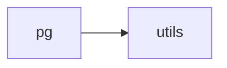
<!---Documatic-block-system_architecture-end--->

# #
<!---Documatic-section-Codebase Structure-end--->

<!---Documatic-section-safe_rl.pg.utils.combined_shape-start--->
## safe_rl.pg.utils.combined_shape

<!---Documatic-section-combined_shape-start--->
<!---Documatic-block-safe_rl.pg.utils.combined_shape-start--->
<details>
	<summary><code>safe_rl.pg.utils.combined_shape</code> code snippet</summary>

```python
def combined_shape(length, shape=None):
    if shape is None:
        return (length,)
    return (length, shape) if np.isscalar(shape) else (length, *shape)
```
</details>
<!---Documatic-block-safe_rl.pg.utils.combined_shape-end--->
<!---Documatic-section-combined_shape-end--->

# #
<!---Documatic-section-safe_rl.pg.utils.combined_shape-end--->

<!---Documatic-section-safe_rl.pg.utils.values_as_sorted_list-start--->
## safe_rl.pg.utils.values_as_sorted_list

<!---Documatic-section-values_as_sorted_list-start--->
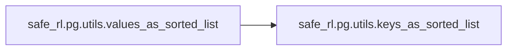

### Object Calls

* safe_rl.pg.utils.keys_as_sorted_list

<!---Documatic-block-safe_rl.pg.utils.values_as_sorted_list-start--->
<details>
	<summary><code>safe_rl.pg.utils.values_as_sorted_list</code> code snippet</summary>

```python
def values_as_sorted_list(dict):
    return [dict[k] for k in keys_as_sorted_list(dict)]
```
</details>
<!---Documatic-block-safe_rl.pg.utils.values_as_sorted_list-end--->
<!---Documatic-section-values_as_sorted_list-end--->

# #
<!---Documatic-section-safe_rl.pg.utils.values_as_sorted_list-end--->

<!---Documatic-section-safe_rl.pg.algos.ppo-start--->
## safe_rl.pg.algos.ppo

<!---Documatic-section-ppo-start--->
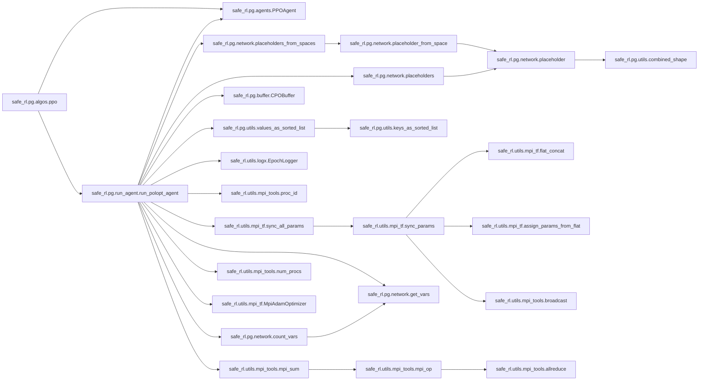

### Object Calls

* safe_rl.pg.agents.PPOAgent
* safe_rl.pg.run_agent.run_polopt_agent

<!---Documatic-block-safe_rl.pg.algos.ppo-start--->
<details>
	<summary><code>safe_rl.pg.algos.ppo</code> code snippet</summary>

```python
def ppo(**kwargs):
    ppo_kwargs = dict(reward_penalized=False, objective_penalized=False, learn_penalty=False, penalty_param_loss=False)
    agent = PPOAgent(**ppo_kwargs)
    run_polopt_agent(agent=agent, **kwargs)
```
</details>
<!---Documatic-block-safe_rl.pg.algos.ppo-end--->
<!---Documatic-section-ppo-end--->

# #
<!---Documatic-section-safe_rl.pg.algos.ppo-end--->

<!---Documatic-section-safe_rl.pg.algos.ppo_lagrangian-start--->
## safe_rl.pg.algos.ppo_lagrangian

<!---Documatic-section-ppo_lagrangian-start--->
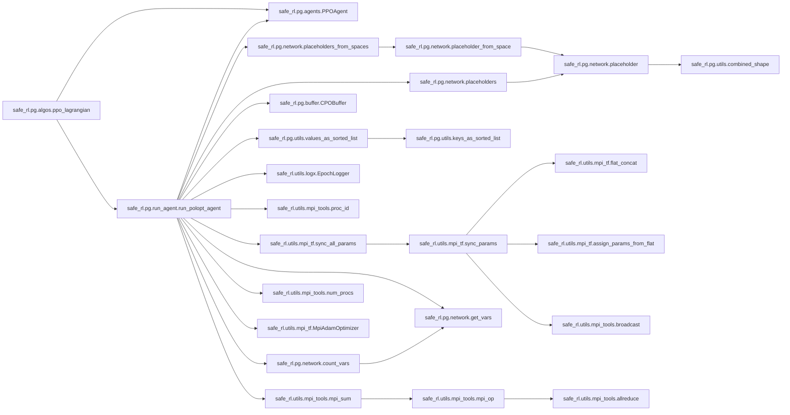

### Object Calls

* safe_rl.pg.agents.PPOAgent
* safe_rl.pg.run_agent.run_polopt_agent

<!---Documatic-block-safe_rl.pg.algos.ppo_lagrangian-start--->
<details>
	<summary><code>safe_rl.pg.algos.ppo_lagrangian</code> code snippet</summary>

```python
def ppo_lagrangian(**kwargs):
    ppo_kwargs = dict(reward_penalized=False, objective_penalized=True, learn_penalty=True, penalty_param_loss=True)
    agent = PPOAgent(**ppo_kwargs)
    run_polopt_agent(agent=agent, **kwargs)
```
</details>
<!---Documatic-block-safe_rl.pg.algos.ppo_lagrangian-end--->
<!---Documatic-section-ppo_lagrangian-end--->

# #
<!---Documatic-section-safe_rl.pg.algos.ppo_lagrangian-end--->

<!---Documatic-section-safe_rl.pg.algos.trpo-start--->
## safe_rl.pg.algos.trpo

<!---Documatic-section-trpo-start--->
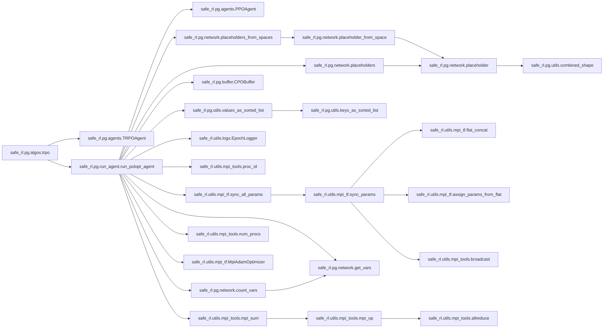

### Object Calls

* safe_rl.pg.agents.TRPOAgent
* safe_rl.pg.run_agent.run_polopt_agent

<!---Documatic-block-safe_rl.pg.algos.trpo-start--->
<details>
	<summary><code>safe_rl.pg.algos.trpo</code> code snippet</summary>

```python
def trpo(**kwargs):
    trpo_kwargs = dict(reward_penalized=False, objective_penalized=False, learn_penalty=False, penalty_param_loss=False)
    agent = TRPOAgent(**trpo_kwargs)
    run_polopt_agent(agent=agent, **kwargs)
```
</details>
<!---Documatic-block-safe_rl.pg.algos.trpo-end--->
<!---Documatic-section-trpo-end--->

# #
<!---Documatic-section-safe_rl.pg.algos.trpo-end--->

<!---Documatic-section-safe_rl.pg.algos.trpo_lagrangian-start--->
## safe_rl.pg.algos.trpo_lagrangian

<!---Documatic-section-trpo_lagrangian-start--->
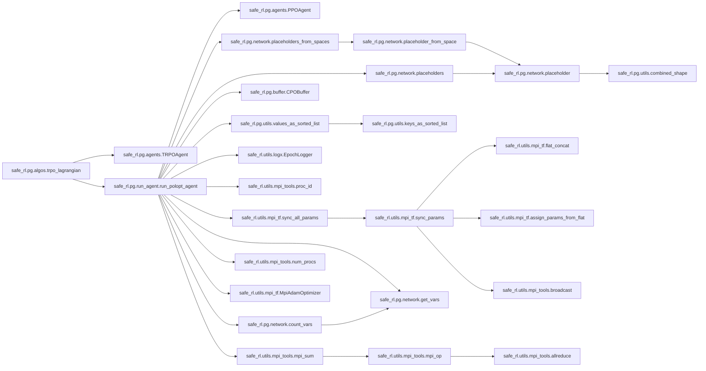

### Object Calls

* safe_rl.pg.agents.TRPOAgent
* safe_rl.pg.run_agent.run_polopt_agent

<!---Documatic-block-safe_rl.pg.algos.trpo_lagrangian-start--->
<details>
	<summary><code>safe_rl.pg.algos.trpo_lagrangian</code> code snippet</summary>

```python
def trpo_lagrangian(**kwargs):
    trpo_kwargs = dict(reward_penalized=False, objective_penalized=True, learn_penalty=True, penalty_param_loss=True)
    agent = TRPOAgent(**trpo_kwargs)
    run_polopt_agent(agent=agent, **kwargs)
```
</details>
<!---Documatic-block-safe_rl.pg.algos.trpo_lagrangian-end--->
<!---Documatic-section-trpo_lagrangian-end--->

# #
<!---Documatic-section-safe_rl.pg.algos.trpo_lagrangian-end--->

<!---Documatic-section-safe_rl.pg.algos.cpo-start--->
## safe_rl.pg.algos.cpo

<!---Documatic-section-cpo-start--->


### Object Calls

* safe_rl.pg.agents.CPOAgent
* safe_rl.pg.run_agent.run_polopt_agent

<!---Documatic-block-safe_rl.pg.algos.cpo-start--->
<details>
	<summary><code>safe_rl.pg.algos.cpo</code> code snippet</summary>

```python
def cpo(**kwargs):
    cpo_kwargs = dict(reward_penalized=False, objective_penalized=False, learn_penalty=False, penalty_param_loss=False)
    agent = CPOAgent(**cpo_kwargs)
    run_polopt_agent(agent=agent, **kwargs)
```
</details>
<!---Documatic-block-safe_rl.pg.algos.cpo-end--->
<!---Documatic-section-cpo-end--->

# #
<!---Documatic-section-safe_rl.pg.algos.cpo-end--->

<!---Documatic-section-safe_rl.pg.network.count_vars-start--->
## safe_rl.pg.network.count_vars

<!---Documatic-section-count_vars-start--->
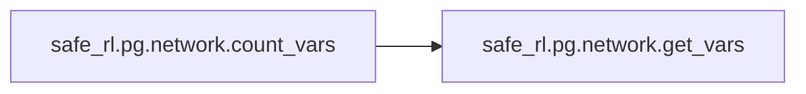

### Object Calls

* safe_rl.pg.network.get_vars

<!---Documatic-block-safe_rl.pg.network.count_vars-start--->
<details>
	<summary><code>safe_rl.pg.network.count_vars</code> code snippet</summary>

```python
def count_vars(scope=''):
    v = get_vars(scope)
    return sum([np.prod(var.shape.as_list()) for var in v])
```
</details>
<!---Documatic-block-safe_rl.pg.network.count_vars-end--->
<!---Documatic-section-count_vars-end--->

# #
<!---Documatic-section-safe_rl.pg.network.count_vars-end--->

<!---Documatic-section-safe_rl.pg.network.get_vars-start--->
## safe_rl.pg.network.get_vars

<!---Documatic-section-get_vars-start--->
<!---Documatic-block-safe_rl.pg.network.get_vars-start--->
<details>
	<summary><code>safe_rl.pg.network.get_vars</code> code snippet</summary>

```python
def get_vars(scope=''):
    return [x for x in tf.trainable_variables() if scope in x.name]
```
</details>
<!---Documatic-block-safe_rl.pg.network.get_vars-end--->
<!---Documatic-section-get_vars-end--->

# #
<!---Documatic-section-safe_rl.pg.network.get_vars-end--->

<!---Documatic-section-safe_rl.pg.network.mlp_actor_critic-start--->
## safe_rl.pg.network.mlp_actor_critic

<!---Documatic-section-mlp_actor_critic-start--->
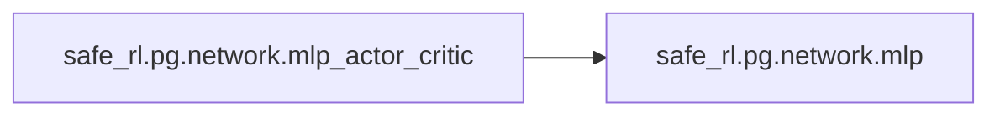

### Object Calls

* safe_rl.pg.network.mlp

<!---Documatic-block-safe_rl.pg.network.mlp_actor_critic-start--->
<details>
	<summary><code>safe_rl.pg.network.mlp_actor_critic</code> code snippet</summary>

```python
def mlp_actor_critic(x, a, hidden_sizes=(64, 64), activation=tf.tanh, output_activation=None, policy=None, action_space=None):
    if policy is None and isinstance(action_space, Box):
        policy = mlp_gaussian_policy
    elif policy is None and isinstance(action_space, Discrete):
        policy = mlp_categorical_policy
    with tf.variable_scope('pi'):
        policy_outs = policy(x, a, hidden_sizes, activation, output_activation, action_space)
        (pi, logp, logp_pi, pi_info, pi_info_phs, d_kl, ent) = policy_outs
    with tf.variable_scope('vf'):
        v = tf.squeeze(mlp(x, list(hidden_sizes) + [1], activation, None), axis=1)
    with tf.variable_scope('vc'):
        vc = tf.squeeze(mlp(x, list(hidden_sizes) + [1], activation, None), axis=1)
    return (pi, logp, logp_pi, pi_info, pi_info_phs, d_kl, ent, v, vc)
```
</details>
<!---Documatic-block-safe_rl.pg.network.mlp_actor_critic-end--->
<!---Documatic-section-mlp_actor_critic-end--->

# #
<!---Documatic-section-safe_rl.pg.network.mlp_actor_critic-end--->

<!---Documatic-section-safe_rl.pg.network.placeholders-start--->
## safe_rl.pg.network.placeholders

<!---Documatic-section-placeholders-start--->
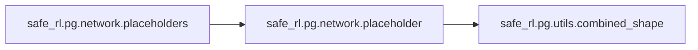

### Object Calls

* safe_rl.pg.network.placeholder

<!---Documatic-block-safe_rl.pg.network.placeholders-start--->
<details>
	<summary><code>safe_rl.pg.network.placeholders</code> code snippet</summary>

```python
def placeholders(*args):
    return [placeholder(dim) for dim in args]
```
</details>
<!---Documatic-block-safe_rl.pg.network.placeholders-end--->
<!---Documatic-section-placeholders-end--->

# #
<!---Documatic-section-safe_rl.pg.network.placeholders-end--->

<!---Documatic-section-safe_rl.pg.network.placeholders_from_spaces-start--->
## safe_rl.pg.network.placeholders_from_spaces

<!---Documatic-section-placeholders_from_spaces-start--->
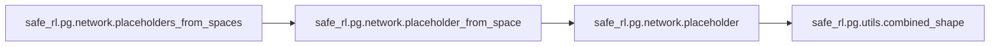

### Object Calls

* safe_rl.pg.network.placeholder_from_space

<!---Documatic-block-safe_rl.pg.network.placeholders_from_spaces-start--->
<details>
	<summary><code>safe_rl.pg.network.placeholders_from_spaces</code> code snippet</summary>

```python
def placeholders_from_spaces(*args):
    return [placeholder_from_space(space) for space in args]
```
</details>
<!---Documatic-block-safe_rl.pg.network.placeholders_from_spaces-end--->
<!---Documatic-section-placeholders_from_spaces-end--->

# #
<!---Documatic-section-safe_rl.pg.network.placeholders_from_spaces-end--->

<!---Documatic-section-safe_rl.pg.utils.keys_as_sorted_list-start--->
## safe_rl.pg.utils.keys_as_sorted_list

<!---Documatic-section-keys_as_sorted_list-start--->
<!---Documatic-block-safe_rl.pg.utils.keys_as_sorted_list-start--->
<details>
	<summary><code>safe_rl.pg.utils.keys_as_sorted_list</code> code snippet</summary>

```python
def keys_as_sorted_list(dict):
    return sorted(list(dict.keys()))
```
</details>
<!---Documatic-block-safe_rl.pg.utils.keys_as_sorted_list-end--->
<!---Documatic-section-keys_as_sorted_list-end--->

# #
<!---Documatic-section-safe_rl.pg.utils.keys_as_sorted_list-end--->

<!---Documatic-section-safe_rl.pg.utils.discount_cumsum-start--->
## safe_rl.pg.utils.discount_cumsum

<!---Documatic-section-discount_cumsum-start--->
<!---Documatic-block-safe_rl.pg.utils.discount_cumsum-start--->
<details>
	<summary><code>safe_rl.pg.utils.discount_cumsum</code> code snippet</summary>

```python
def discount_cumsum(x, discount):
    return scipy.signal.lfilter([1], [1, float(-discount)], x[::-1], axis=0)[::-1]
```
</details>
<!---Documatic-block-safe_rl.pg.utils.discount_cumsum-end--->
<!---Documatic-section-discount_cumsum-end--->

# #
<!---Documatic-section-safe_rl.pg.utils.discount_cumsum-end--->

<!---Documatic-section-safe_rl.pg.run_agent.run_polopt_agent-start--->
## safe_rl.pg.run_agent.run_polopt_agent

<!---Documatic-section-run_polopt_agent-start--->
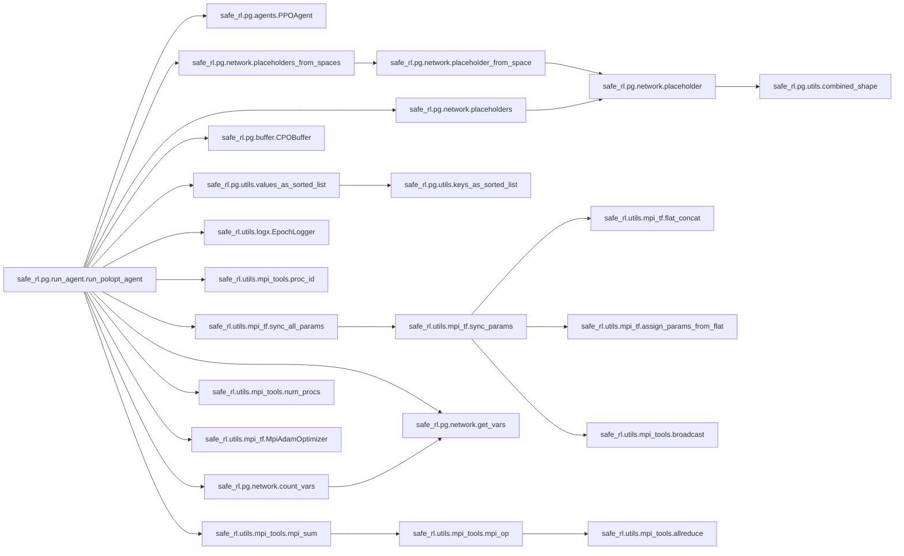

### Object Calls

* safe_rl.pg.agents.PPOAgent
* safe_rl.pg.network.placeholders_from_spaces
* safe_rl.pg.network.placeholders
* safe_rl.pg.utils.values_as_sorted_list
* safe_rl.pg.buffer.CPOBuffer
* safe_rl.utils.mpi_tf.sync_all_params
* safe_rl.utils.logx.EpochLogger
* safe_rl.utils.mpi_tools.proc_id
* safe_rl.pg.network.get_vars
* safe_rl.utils.mpi_tools.mpi_sum
* safe_rl.pg.network.count_vars
* safe_rl.utils.mpi_tools.num_procs
* safe_rl.utils.mpi_tf.MpiAdamOptimizer

<!---Documatic-block-safe_rl.pg.run_agent.run_polopt_agent-start--->
<details>
	<summary><code>safe_rl.pg.run_agent.run_polopt_agent</code> code snippet</summary>

```python
def run_polopt_agent(env_fn, agent=PPOAgent(), actor_critic=mlp_actor_critic, ac_kwargs=dict(), seed=0, render=False, steps_per_epoch=4000, epochs=50, max_ep_len=1000, gamma=0.99, lam=0.97, cost_gamma=0.99, cost_lam=0.97, ent_reg=0.0, cost_lim=25, penalty_init=1.0, penalty_lr=0.05, target_kl=0.01, vf_lr=0.001, vf_iters=80, logger=None, logger_kwargs=dict(), save_freq=1):
    logger = EpochLogger(**logger_kwargs) if logger is None else logger
    logger.save_config(locals())
    seed += 10000 * proc_id()
    tf.set_random_seed(seed)
    np.random.seed(seed)
    env = env_fn()
    agent.set_logger(logger)
    ac_kwargs['action_space'] = env.action_space
    (x_ph, a_ph) = placeholders_from_spaces(env.observation_space, env.action_space)
    (adv_ph, cadv_ph, ret_ph, cret_ph, logp_old_ph) = placeholders(*(None for _ in range(5)))
    surr_cost_rescale_ph = tf.placeholder(tf.float32, shape=())
    cur_cost_ph = tf.placeholder(tf.float32, shape=())
    ac_outs = actor_critic(x_ph, a_ph, **ac_kwargs)
    (pi, logp, logp_pi, pi_info, pi_info_phs, d_kl, ent, v, vc) = ac_outs
    buf_phs = [x_ph, a_ph, adv_ph, cadv_ph, ret_ph, cret_ph, logp_old_ph]
    buf_phs += values_as_sorted_list(pi_info_phs)
    get_action_ops = dict(pi=pi, v=v, logp_pi=logp_pi, pi_info=pi_info)
    if not agent.reward_penalized:
        get_action_ops['vc'] = vc
    var_counts = tuple((count_vars(scope) for scope in ['pi', 'vf', 'vc']))
    logger.log('\nNumber of parameters: \t pi: %d, \t v: %d, \t vc: %d\n' % var_counts)
    approx_ent = tf.reduce_mean(-logp)
    obs_shape = env.observation_space.shape
    act_shape = env.action_space.shape
    local_steps_per_epoch = int(steps_per_epoch / num_procs())
    pi_info_shapes = {k: v.shape.as_list()[1:] for (k, v) in pi_info_phs.items()}
    buf = CPOBuffer(local_steps_per_epoch, obs_shape, act_shape, pi_info_shapes, gamma, lam, cost_gamma, cost_lam)
    if agent.use_penalty:
        with tf.variable_scope('penalty'):
            param_init = np.log(max(np.exp(penalty_init) - 1, 1e-08))
            penalty_param = tf.get_variable('penalty_param', initializer=float(param_init), trainable=agent.learn_penalty, dtype=tf.float32)
        penalty = tf.nn.softplus(penalty_param)
    if agent.learn_penalty:
        if agent.penalty_param_loss:
            penalty_loss = -penalty_param * (cur_cost_ph - cost_lim)
        else:
            penalty_loss = -penalty * (cur_cost_ph - cost_lim)
        train_penalty = MpiAdamOptimizer(learning_rate=penalty_lr).minimize(penalty_loss)
    ratio = tf.exp(logp - logp_old_ph)
    if agent.clipped_adv:
        min_adv = tf.where(adv_ph > 0, (1 + agent.clip_ratio) * adv_ph, (1 - agent.clip_ratio) * adv_ph)
        surr_adv = tf.reduce_mean(tf.minimum(ratio * adv_ph, min_adv))
    else:
        surr_adv = tf.reduce_mean(ratio * adv_ph)
    surr_cost = tf.reduce_mean(ratio * cadv_ph)
    pi_objective = surr_adv + ent_reg * ent
    if agent.objective_penalized:
        pi_objective -= penalty * surr_cost
        pi_objective /= 1 + penalty
    pi_loss = -pi_objective
    if agent.trust_region:
        pi_params = get_vars('pi')
        flat_g = tro.flat_grad(pi_loss, pi_params)
        (v_ph, hvp) = tro.hessian_vector_product(d_kl, pi_params)
        if agent.damping_coeff > 0:
            hvp += agent.damping_coeff * v_ph
        flat_b = tro.flat_grad(surr_cost, pi_params)
        get_pi_params = tro.flat_concat(pi_params)
        set_pi_params = tro.assign_params_from_flat(v_ph, pi_params)
        training_package = dict(flat_g=flat_g, flat_b=flat_b, v_ph=v_ph, hvp=hvp, get_pi_params=get_pi_params, set_pi_params=set_pi_params)
    elif agent.first_order:
        train_pi = MpiAdamOptimizer(learning_rate=agent.pi_lr).minimize(pi_loss)
        training_package = dict(train_pi=train_pi)
    else:
        raise NotImplementedError
    training_package.update(dict(pi_loss=pi_loss, surr_cost=surr_cost, d_kl=d_kl, target_kl=target_kl, cost_lim=cost_lim))
    agent.prepare_update(training_package)
    v_loss = tf.reduce_mean((ret_ph - v) ** 2)
    vc_loss = tf.reduce_mean((cret_ph - vc) ** 2)
    if agent.reward_penalized:
        total_value_loss = v_loss
    else:
        total_value_loss = v_loss + vc_loss
    train_vf = MpiAdamOptimizer(learning_rate=vf_lr).minimize(total_value_loss)
    sess = tf.Session()
    sess.run(tf.global_variables_initializer())
    sess.run(sync_all_params())
    logger.setup_tf_saver(sess, inputs={'x': x_ph}, outputs={'pi': pi, 'v': v, 'vc': vc})
    agent.prepare_session(sess)

    def update():
        cur_cost = logger.get_stats('EpCost')[0]
        c = cur_cost - cost_lim
        if c > 0 and agent.cares_about_cost:
            logger.log('Warning! Safety constraint is already violated.', 'red')
        inputs = {k: v for (k, v) in zip(buf_phs, buf.get())}
        inputs[surr_cost_rescale_ph] = logger.get_stats('EpLen')[0]
        inputs[cur_cost_ph] = cur_cost
        measures = dict(LossPi=pi_loss, SurrCost=surr_cost, LossV=v_loss, Entropy=ent)
        if not agent.reward_penalized:
            measures['LossVC'] = vc_loss
        if agent.use_penalty:
            measures['Penalty'] = penalty
        pre_update_measures = sess.run(measures, feed_dict=inputs)
        logger.store(**pre_update_measures)
        if agent.learn_penalty:
            sess.run(train_penalty, feed_dict={cur_cost_ph: cur_cost})
        agent.update_pi(inputs)
        for _ in range(vf_iters):
            sess.run(train_vf, feed_dict=inputs)
        del measures['Entropy']
        measures['KL'] = d_kl
        post_update_measures = sess.run(measures, feed_dict=inputs)
        deltas = dict()
        for k in post_update_measures:
            if k in pre_update_measures:
                deltas['Delta' + k] = post_update_measures[k] - pre_update_measures[k]
        logger.store(KL=post_update_measures['KL'], **deltas)
    start_time = time.time()
    (o, r, d, c, ep_ret, ep_cost, ep_len) = (env.reset(), 0, False, 0, 0, 0, 0)
    cur_penalty = 0
    cum_cost = 0
    for epoch in range(epochs):
        if agent.use_penalty:
            cur_penalty = sess.run(penalty)
        for t in range(local_steps_per_epoch):
            if render and proc_id() == 0 and (t < 1000):
                env.render()
            get_action_outs = sess.run(get_action_ops, feed_dict={x_ph: o[np.newaxis]})
            a = get_action_outs['pi']
            v_t = get_action_outs['v']
            vc_t = get_action_outs.get('vc', 0)
            logp_t = get_action_outs['logp_pi']
            pi_info_t = get_action_outs['pi_info']
            (o2, r, d, info) = env.step(a)
            c = info.get('cost', 0)
            cum_cost += c
            if agent.reward_penalized:
                r_total = r - cur_penalty * c
                r_total = r_total / (1 + cur_penalty)
                buf.store(o, a, r_total, v_t, 0, 0, logp_t, pi_info_t)
            else:
                buf.store(o, a, r, v_t, c, vc_t, logp_t, pi_info_t)
            logger.store(VVals=v_t, CostVVals=vc_t)
            o = o2
            ep_ret += r
            ep_cost += c
            ep_len += 1
            terminal = d or ep_len == max_ep_len
            if terminal or t == local_steps_per_epoch - 1:
                if d and (not ep_len == max_ep_len):
                    (last_val, last_cval) = (0, 0)
                else:
                    feed_dict = {x_ph: o[np.newaxis]}
                    if agent.reward_penalized:
                        last_val = sess.run(v, feed_dict=feed_dict)
                        last_cval = 0
                    else:
                        (last_val, last_cval) = sess.run([v, vc], feed_dict=feed_dict)
                buf.finish_path(last_val, last_cval)
                if terminal:
                    logger.store(EpRet=ep_ret, EpLen=ep_len, EpCost=ep_cost)
                else:
                    print('Warning: trajectory cut off by epoch at %d steps.' % ep_len)
                (o, r, d, c, ep_ret, ep_len, ep_cost) = (env.reset(), 0, False, 0, 0, 0, 0)
        if epoch % save_freq == 0 or epoch == epochs - 1:
            logger.save_state({'env': env}, None)
        update()
        cumulative_cost = mpi_sum(cum_cost)
        cost_rate = cumulative_cost / ((epoch + 1) * steps_per_epoch)
        logger.log_tabular('Epoch', epoch)
        logger.log_tabular('EpRet', with_min_and_max=True)
        logger.log_tabular('EpCost', with_min_and_max=True)
        logger.log_tabular('EpLen', average_only=True)
        logger.log_tabular('CumulativeCost', cumulative_cost)
        logger.log_tabular('CostRate', cost_rate)
        logger.log_tabular('VVals', with_min_and_max=True)
        logger.log_tabular('CostVVals', with_min_and_max=True)
        logger.log_tabular('LossPi', average_only=True)
        logger.log_tabular('DeltaLossPi', average_only=True)
        logger.log_tabular('SurrCost', average_only=True)
        logger.log_tabular('DeltaSurrCost', average_only=True)
        logger.log_tabular('LossV', average_only=True)
        logger.log_tabular('DeltaLossV', average_only=True)
        if not agent.reward_penalized:
            logger.log_tabular('LossVC', average_only=True)
            logger.log_tabular('DeltaLossVC', average_only=True)
        if agent.use_penalty or agent.save_penalty:
            logger.log_tabular('Penalty', average_only=True)
            logger.log_tabular('DeltaPenalty', average_only=True)
        else:
            logger.log_tabular('Penalty', 0)
            logger.log_tabular('DeltaPenalty', 0)
        agent.log()
        logger.log_tabular('Entropy', average_only=True)
        logger.log_tabular('KL', average_only=True)
        logger.log_tabular('TotalEnvInteracts', (epoch + 1) * steps_per_epoch)
        logger.log_tabular('Time', time.time() - start_time)
        logger.dump_tabular()
```
</details>
<!---Documatic-block-safe_rl.pg.run_agent.run_polopt_agent-end--->
<!---Documatic-section-run_polopt_agent-end--->

# #
<!---Documatic-section-safe_rl.pg.run_agent.run_polopt_agent-end--->

<!---Documatic-section-safe_rl.pg.network.placeholder_from_space-start--->
## safe_rl.pg.network.placeholder_from_space

<!---Documatic-section-placeholder_from_space-start--->
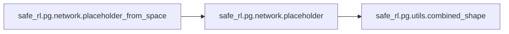

### Object Calls

* safe_rl.pg.network.placeholder

<!---Documatic-block-safe_rl.pg.network.placeholder_from_space-start--->
<details>
	<summary><code>safe_rl.pg.network.placeholder_from_space</code> code snippet</summary>

```python
def placeholder_from_space(space):
    if isinstance(space, Box):
        return placeholder(space.shape)
    elif isinstance(space, Discrete):
        return tf.placeholder(dtype=tf.int32, shape=(None,))
    raise NotImplementedError('bad space {}'.format(space))
```
</details>
<!---Documatic-block-safe_rl.pg.network.placeholder_from_space-end--->
<!---Documatic-section-placeholder_from_space-end--->

# #
<!---Documatic-section-safe_rl.pg.network.placeholder_from_space-end--->

<!---Documatic-section-safe_rl.pg.agents.CPOAgent-start--->
## safe_rl.pg.agents.CPOAgent

<!---Documatic-section-CPOAgent-start--->
<!---Documatic-block-safe_rl.pg.agents.CPOAgent-start--->
<details>
	<summary><code>safe_rl.pg.agents.CPOAgent</code> code snippet</summary>

```python
class CPOAgent(TrustRegionAgent):

    def __init__(self, learn_margin=False, **kwargs):
        super().__init__(**kwargs)
        self.learn_margin = learn_margin
        self.params.update(dict(constrained=True, save_penalty=True))
        self.margin = 0
        self.margin_lr = 0.05

    def update_pi(self, inputs):
        flat_g = self.training_package['flat_g']
        flat_b = self.training_package['flat_b']
        v_ph = self.training_package['v_ph']
        hvp = self.training_package['hvp']
        get_pi_params = self.training_package['get_pi_params']
        set_pi_params = self.training_package['set_pi_params']
        pi_loss = self.training_package['pi_loss']
        surr_cost = self.training_package['surr_cost']
        d_kl = self.training_package['d_kl']
        target_kl = self.training_package['target_kl']
        cost_lim = self.training_package['cost_lim']
        Hx = lambda x: mpi_avg(self.sess.run(hvp, feed_dict={**inputs, v_ph: x}))
        outs = self.sess.run([flat_g, flat_b, pi_loss, surr_cost], feed_dict=inputs)
        outs = [mpi_avg(out) for out in outs]
        (g, b, pi_l_old, surr_cost_old) = outs
        old_params = self.sess.run(get_pi_params)
        c = self.logger.get_stats('EpCost')[0] - cost_lim
        rescale = self.logger.get_stats('EpLen')[0]
        if self.learn_margin:
            self.margin += self.margin_lr * c
            self.margin = max(0, self.margin)
        self.margin = mpi_avg(self.margin)
        c += self.margin
        c /= rescale + EPS
        v = tro.cg(Hx, g)
        approx_g = Hx(v)
        q = np.dot(v, approx_g)
        if np.dot(b, b) <= 1e-08 and c < 0:
            (w, r, s, A, B) = (0, 0, 0, 0, 0)
            optim_case = 4
        else:
            w = tro.cg(Hx, b)
            r = np.dot(w, approx_g)
            s = np.dot(w, Hx(w))
            A = q - r ** 2 / s
            B = 2 * target_kl - c ** 2 / s
            if c < 0 and B < 0:
                optim_case = 3
            elif c < 0 and B >= 0:
                optim_case = 2
            elif c >= 0 and B >= 0:
                optim_case = 1
                self.logger.log('Alert! Attempting feasible recovery!', 'yellow')
            else:
                optim_case = 0
                self.logger.log('Alert! Attempting infeasible recovery!', 'red')
        if optim_case in [3, 4]:
            lam = np.sqrt(q / (2 * target_kl))
            nu = 0
        elif optim_case in [1, 2]:
            (LA, LB) = ([0, r / c], [r / c, np.inf])
            (LA, LB) = (LA, LB) if c < 0 else (LB, LA)
            proj = lambda x, L: max(L[0], min(L[1], x))
            lam_a = proj(np.sqrt(A / B), LA)
            lam_b = proj(np.sqrt(q / (2 * target_kl)), LB)
            f_a = lambda lam: -0.5 * (A / (lam + EPS) + B * lam) - r * c / (s + EPS)
            f_b = lambda lam: -0.5 * (q / (lam + EPS) + 2 * target_kl * lam)
            lam = lam_a if f_a(lam_a) >= f_b(lam_b) else lam_b
            nu = max(0, lam * c - r) / (s + EPS)
        else:
            lam = 0
            nu = np.sqrt(2 * target_kl / (s + EPS))
        x = 1.0 / (lam + EPS) * (v + nu * w) if optim_case > 0 else nu * w
        self.logger.store(Optim_A=A, Optim_B=B, Optim_c=c, Optim_q=q, Optim_r=r, Optim_s=s, Optim_Lam=lam, Optim_Nu=nu, Penalty=nu, DeltaPenalty=0, Margin=self.margin, OptimCase=optim_case)

        def set_and_eval(step):
            self.sess.run(set_pi_params, feed_dict={v_ph: old_params - step * x})
            return mpi_avg(self.sess.run([d_kl, pi_loss, surr_cost], feed_dict=inputs))
        self.logger.log('surr_cost_old %.3f' % surr_cost_old, 'blue')
        for j in range(self.backtrack_iters):
            (kl, pi_l_new, surr_cost_new) = set_and_eval(step=self.backtrack_coeff ** j)
            self.logger.log('%d \tkl %.3f \tsurr_cost_new %.3f' % (j, kl, surr_cost_new), 'blue')
            if kl <= target_kl and (pi_l_new <= pi_l_old if optim_case > 1 else True) and (surr_cost_new - surr_cost_old <= max(-c, 0)):
                self.logger.log('Accepting new params at step %d of line search.' % j)
                self.logger.store(BacktrackIters=j)
                break
            if j == self.backtrack_iters - 1:
                self.logger.log('Line search failed! Keeping old params.')
                self.logger.store(BacktrackIters=j)
                (kl, pi_l_new, surr_cost_new) = set_and_eval(step=0.0)

    def log(self):
        self.logger.log_tabular('Optim_A', average_only=True)
        self.logger.log_tabular('Optim_B', average_only=True)
        self.logger.log_tabular('Optim_c', average_only=True)
        self.logger.log_tabular('Optim_q', average_only=True)
        self.logger.log_tabular('Optim_r', average_only=True)
        self.logger.log_tabular('Optim_s', average_only=True)
        self.logger.log_tabular('Optim_Lam', average_only=True)
        self.logger.log_tabular('Optim_Nu', average_only=True)
        self.logger.log_tabular('OptimCase', average_only=True)
        self.logger.log_tabular('Margin', average_only=True)
        self.logger.log_tabular('BacktrackIters', average_only=True)
```
</details>
<!---Documatic-block-safe_rl.pg.agents.CPOAgent-end--->
<!---Documatic-section-CPOAgent-end--->

# #
<!---Documatic-section-safe_rl.pg.agents.CPOAgent-end--->

<!---Documatic-section-safe_rl.pg.buffer.CPOBuffer-start--->
## safe_rl.pg.buffer.CPOBuffer

<!---Documatic-section-CPOBuffer-start--->
<!---Documatic-block-safe_rl.pg.buffer.CPOBuffer-start--->
<details>
	<summary><code>safe_rl.pg.buffer.CPOBuffer</code> code snippet</summary>

```python
class CPOBuffer:

    def __init__(self, size, obs_shape, act_shape, pi_info_shapes, gamma=0.99, lam=0.95, cost_gamma=0.99, cost_lam=0.95):
        self.obs_buf = np.zeros(combined_shape(size, obs_shape), dtype=np.float32)
        self.act_buf = np.zeros(combined_shape(size, act_shape), dtype=np.float32)
        self.adv_buf = np.zeros(size, dtype=np.float32)
        self.rew_buf = np.zeros(size, dtype=np.float32)
        self.ret_buf = np.zeros(size, dtype=np.float32)
        self.val_buf = np.zeros(size, dtype=np.float32)
        self.cadv_buf = np.zeros(size, dtype=np.float32)
        self.cost_buf = np.zeros(size, dtype=np.float32)
        self.cret_buf = np.zeros(size, dtype=np.float32)
        self.cval_buf = np.zeros(size, dtype=np.float32)
        self.logp_buf = np.zeros(size, dtype=np.float32)
        self.pi_info_bufs = {k: np.zeros([size] + list(v), dtype=np.float32) for (k, v) in pi_info_shapes.items()}
        self.sorted_pi_info_keys = keys_as_sorted_list(self.pi_info_bufs)
        (self.gamma, self.lam) = (gamma, lam)
        (self.cost_gamma, self.cost_lam) = (cost_gamma, cost_lam)
        (self.ptr, self.path_start_idx, self.max_size) = (0, 0, size)

    def store(self, obs, act, rew, val, cost, cval, logp, pi_info):
        assert self.ptr < self.max_size
        self.obs_buf[self.ptr] = obs
        self.act_buf[self.ptr] = act
        self.rew_buf[self.ptr] = rew
        self.val_buf[self.ptr] = val
        self.cost_buf[self.ptr] = cost
        self.cval_buf[self.ptr] = cval
        self.logp_buf[self.ptr] = logp
        for k in self.sorted_pi_info_keys:
            self.pi_info_bufs[k][self.ptr] = pi_info[k]
        self.ptr += 1

    def finish_path(self, last_val=0, last_cval=0):
        path_slice = slice(self.path_start_idx, self.ptr)
        rews = np.append(self.rew_buf[path_slice], last_val)
        vals = np.append(self.val_buf[path_slice], last_val)
        deltas = rews[:-1] + self.gamma * vals[1:] - vals[:-1]
        self.adv_buf[path_slice] = discount_cumsum(deltas, self.gamma * self.lam)
        self.ret_buf[path_slice] = discount_cumsum(rews, self.gamma)[:-1]
        costs = np.append(self.cost_buf[path_slice], last_cval)
        cvals = np.append(self.cval_buf[path_slice], last_cval)
        cdeltas = costs[:-1] + self.gamma * cvals[1:] - cvals[:-1]
        self.cadv_buf[path_slice] = discount_cumsum(cdeltas, self.cost_gamma * self.cost_lam)
        self.cret_buf[path_slice] = discount_cumsum(costs, self.cost_gamma)[:-1]
        self.path_start_idx = self.ptr

    def get(self):
        assert self.ptr == self.max_size
        (self.ptr, self.path_start_idx) = (0, 0)
        (adv_mean, adv_std) = mpi_statistics_scalar(self.adv_buf)
        self.adv_buf = (self.adv_buf - adv_mean) / (adv_std + EPS)
        (cadv_mean, _) = mpi_statistics_scalar(self.cadv_buf)
        self.cadv_buf -= cadv_mean
        return [self.obs_buf, self.act_buf, self.adv_buf, self.cadv_buf, self.ret_buf, self.cret_buf, self.logp_buf] + values_as_sorted_list(self.pi_info_bufs)
```
</details>
<!---Documatic-block-safe_rl.pg.buffer.CPOBuffer-end--->
<!---Documatic-section-CPOBuffer-end--->

# #
<!---Documatic-section-safe_rl.pg.buffer.CPOBuffer-end--->

<!---Documatic-section-safe_rl.pg.agents.TRPOAgent-start--->
## safe_rl.pg.agents.TRPOAgent

<!---Documatic-section-TRPOAgent-start--->
<!---Documatic-block-safe_rl.pg.agents.TRPOAgent-start--->
<details>
	<summary><code>safe_rl.pg.agents.TRPOAgent</code> code snippet</summary>

```python
class TRPOAgent(TrustRegionAgent):

    def __init__(self, **kwargs):
        super().__init__(**kwargs)
        self.params.update(dict(constrained=False))

    def update_pi(self, inputs):
        flat_g = self.training_package['flat_g']
        v_ph = self.training_package['v_ph']
        hvp = self.training_package['hvp']
        get_pi_params = self.training_package['get_pi_params']
        set_pi_params = self.training_package['set_pi_params']
        pi_loss = self.training_package['pi_loss']
        d_kl = self.training_package['d_kl']
        target_kl = self.training_package['target_kl']
        Hx = lambda x: mpi_avg(self.sess.run(hvp, feed_dict={**inputs, v_ph: x}))
        (g, pi_l_old) = self.sess.run([flat_g, pi_loss], feed_dict=inputs)
        (g, pi_l_old) = (mpi_avg(g), mpi_avg(pi_l_old))
        x = tro.cg(Hx, g)
        alpha = np.sqrt(2 * target_kl / (np.dot(x, Hx(x)) + EPS))
        old_params = self.sess.run(get_pi_params)
        self.logger.store(Alpha=alpha)

        def set_and_eval(step):
            self.sess.run(set_pi_params, feed_dict={v_ph: old_params - alpha * x * step})
            return mpi_avg(self.sess.run([d_kl, pi_loss], feed_dict=inputs))
        for j in range(self.backtrack_iters):
            (kl, pi_l_new) = set_and_eval(step=self.backtrack_coeff ** j)
            if kl <= target_kl and pi_l_new <= pi_l_old:
                self.logger.log('Accepting new params at step %d of line search.' % j)
                self.logger.store(BacktrackIters=j)
                break
            if j == self.backtrack_iters - 1:
                self.logger.log('Line search failed! Keeping old params.')
                self.logger.store(BacktrackIters=j)
                (kl, pi_l_new) = set_and_eval(step=0.0)

    def log(self):
        self.logger.log_tabular('Alpha', average_only=True)
        self.logger.log_tabular('BacktrackIters', average_only=True)
```
</details>
<!---Documatic-block-safe_rl.pg.agents.TRPOAgent-end--->
<!---Documatic-section-TRPOAgent-end--->

# #
<!---Documatic-section-safe_rl.pg.agents.TRPOAgent-end--->

<!---Documatic-section-safe_rl.pg.network.placeholder-start--->
## safe_rl.pg.network.placeholder

<!---Documatic-section-placeholder-start--->
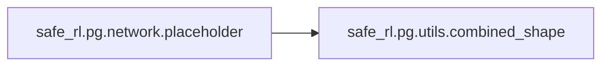

### Object Calls

* safe_rl.pg.utils.combined_shape

<!---Documatic-block-safe_rl.pg.network.placeholder-start--->
<details>
	<summary><code>safe_rl.pg.network.placeholder</code> code snippet</summary>

```python
def placeholder(dim=None):
    return tf.placeholder(dtype=tf.float32, shape=combined_shape(None, dim))
```
</details>
<!---Documatic-block-safe_rl.pg.network.placeholder-end--->
<!---Documatic-section-placeholder-end--->

# #
<!---Documatic-section-safe_rl.pg.network.placeholder-end--->

<!---Documatic-section-safe_rl.pg.network.mlp-start--->
## safe_rl.pg.network.mlp

<!---Documatic-section-mlp-start--->
<!---Documatic-block-safe_rl.pg.network.mlp-start--->
<details>
	<summary><code>safe_rl.pg.network.mlp</code> code snippet</summary>

```python
def mlp(x, hidden_sizes=(32,), activation=tf.tanh, output_activation=None):
    for h in hidden_sizes[:-1]:
        x = tf.layers.dense(x, units=h, activation=activation)
    return tf.layers.dense(x, units=hidden_sizes[-1], activation=output_activation)
```
</details>
<!---Documatic-block-safe_rl.pg.network.mlp-end--->
<!---Documatic-section-mlp-end--->

# #
<!---Documatic-section-safe_rl.pg.network.mlp-end--->

<!---Documatic-section-safe_rl.pg.agents.PPOAgent-start--->
## safe_rl.pg.agents.PPOAgent

<!---Documatic-section-PPOAgent-start--->
<!---Documatic-block-safe_rl.pg.agents.PPOAgent-start--->
<details>
	<summary><code>safe_rl.pg.agents.PPOAgent</code> code snippet</summary>

```python
class PPOAgent(Agent):

    def __init__(self, clip_ratio=0.2, pi_lr=0.0003, pi_iters=80, kl_margin=1.2, **kwargs):
        super().__init__(**kwargs)
        self.clip_ratio = clip_ratio
        self.pi_lr = pi_lr
        self.pi_iters = pi_iters
        self.kl_margin = kl_margin
        self.params.update(dict(clipped_adv=True, first_order=True, constrained=False))

    def update_pi(self, inputs):
        train_pi = self.training_package['train_pi']
        d_kl = self.training_package['d_kl']
        target_kl = self.training_package['target_kl']
        for i in range(self.pi_iters):
            (_, kl) = self.sess.run([train_pi, d_kl], feed_dict=inputs)
            kl = mpi_avg(kl)
            if kl > self.kl_margin * target_kl:
                self.logger.log('Early stopping at step %d due to reaching max kl.' % i)
                break
        self.logger.store(StopIter=i)

    def log(self):
        self.logger.log_tabular('StopIter', average_only=True)
```
</details>
<!---Documatic-block-safe_rl.pg.agents.PPOAgent-end--->
<!---Documatic-section-PPOAgent-end--->

# #
<!---Documatic-section-safe_rl.pg.agents.PPOAgent-end--->

[_Documentation generated by Documatic_](https://www.documatic.com)