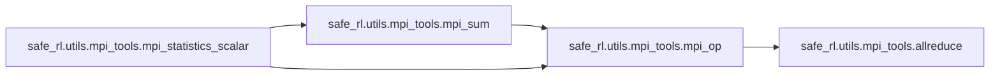
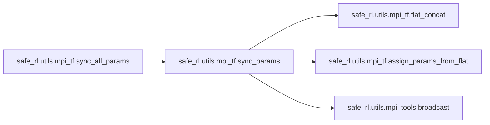
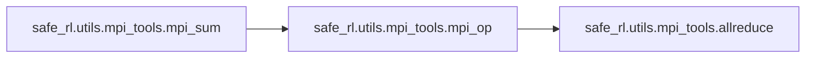
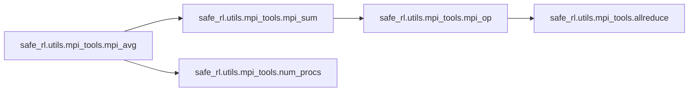
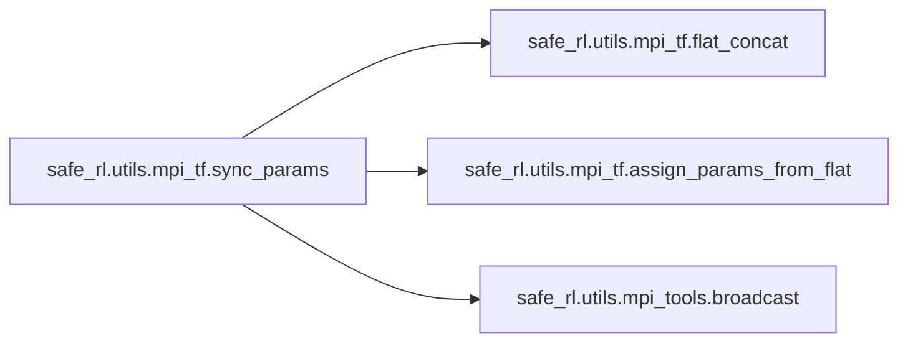
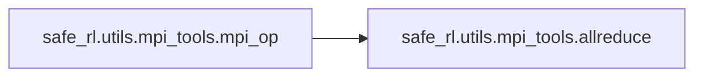

# Safe Rl Utils

[_Documentation generated by Documatic_](https://www.documatic.com)

<!---Documatic-section-Codebase Structure-start--->
## Codebase Structure

<!---Documatic-block-system_architecture-start--->
```mermaid
None
```
<!---Documatic-block-system_architecture-end--->

# #
<!---Documatic-section-Codebase Structure-end--->

<!---Documatic-section-safe_rl.utils.mpi_tools.proc_id-start--->
## safe_rl.utils.mpi_tools.proc_id

<!---Documatic-section-proc_id-start--->
<!---Documatic-block-safe_rl.utils.mpi_tools.proc_id-start--->
<details>
	<summary><code>safe_rl.utils.mpi_tools.proc_id</code> code snippet</summary>

```python
def proc_id():
    return MPI.COMM_WORLD.Get_rank()
```
</details>
<!---Documatic-block-safe_rl.utils.mpi_tools.proc_id-end--->
<!---Documatic-section-proc_id-end--->

# #
<!---Documatic-section-safe_rl.utils.mpi_tools.proc_id-end--->

<!---Documatic-section-safe_rl.utils.mpi_tools.mpi_statistics_scalar-start--->
## safe_rl.utils.mpi_tools.mpi_statistics_scalar

<!---Documatic-section-mpi_statistics_scalar-start--->


### Object Calls

* safe_rl.utils.mpi_tools.mpi_sum
* safe_rl.utils.mpi_tools.mpi_op

<!---Documatic-block-safe_rl.utils.mpi_tools.mpi_statistics_scalar-start--->
<details>
	<summary><code>safe_rl.utils.mpi_tools.mpi_statistics_scalar</code> code snippet</summary>

```python
def mpi_statistics_scalar(x, with_min_and_max=False):
    x = np.array(x, dtype=np.float32)
    (global_sum, global_n) = mpi_sum([np.sum(x), len(x)])
    mean = global_sum / global_n
    global_sum_sq = mpi_sum(np.sum((x - mean) ** 2))
    std = np.sqrt(global_sum_sq / global_n)
    if with_min_and_max:
        global_min = mpi_op(np.min(x) if len(x) > 0 else np.inf, op=MPI.MIN)
        global_max = mpi_op(np.max(x) if len(x) > 0 else -np.inf, op=MPI.MAX)
        return (mean, std, global_min, global_max)
    return (mean, std)
```
</details>
<!---Documatic-block-safe_rl.utils.mpi_tools.mpi_statistics_scalar-end--->
<!---Documatic-section-mpi_statistics_scalar-end--->

# #
<!---Documatic-section-safe_rl.utils.mpi_tools.mpi_statistics_scalar-end--->

<!---Documatic-section-safe_rl.utils.mpi_tf.sync_all_params-start--->
## safe_rl.utils.mpi_tf.sync_all_params

<!---Documatic-section-sync_all_params-start--->


### Object Calls

* safe_rl.utils.mpi_tf.sync_params

<!---Documatic-block-safe_rl.utils.mpi_tf.sync_all_params-start--->
<details>
	<summary><code>safe_rl.utils.mpi_tf.sync_all_params</code> code snippet</summary>

```python
def sync_all_params():
    return sync_params(tf.global_variables())
```
</details>
<!---Documatic-block-safe_rl.utils.mpi_tf.sync_all_params-end--->
<!---Documatic-section-sync_all_params-end--->

# #
<!---Documatic-section-safe_rl.utils.mpi_tf.sync_all_params-end--->

<!---Documatic-section-safe_rl.utils.mpi_tools.mpi_fork-start--->
## safe_rl.utils.mpi_tools.mpi_fork

<!---Documatic-section-mpi_fork-start--->
<!---Documatic-block-safe_rl.utils.mpi_tools.mpi_fork-start--->
<details>
	<summary><code>safe_rl.utils.mpi_tools.mpi_fork</code> code snippet</summary>

```python
def mpi_fork(n, bind_to_core=False):
    if n <= 1:
        return
    if os.getenv('IN_MPI') is None:
        env = os.environ.copy()
        env.update(MKL_NUM_THREADS='1', OMP_NUM_THREADS='1', IN_MPI='1')
        args = ['mpirun', '-np', str(n)]
        if bind_to_core:
            args += ['-bind-to', 'core']
        args += [sys.executable] + sys.argv
        subprocess.check_call(args, env=env)
        sys.exit()
```
</details>
<!---Documatic-block-safe_rl.utils.mpi_tools.mpi_fork-end--->
<!---Documatic-section-mpi_fork-end--->

# #
<!---Documatic-section-safe_rl.utils.mpi_tools.mpi_fork-end--->

<!---Documatic-section-safe_rl.utils.mpi_tools.num_procs-start--->
## safe_rl.utils.mpi_tools.num_procs

<!---Documatic-section-num_procs-start--->
<!---Documatic-block-safe_rl.utils.mpi_tools.num_procs-start--->
<details>
	<summary><code>safe_rl.utils.mpi_tools.num_procs</code> code snippet</summary>

```python
def num_procs():
    return MPI.COMM_WORLD.Get_size()
```
</details>
<!---Documatic-block-safe_rl.utils.mpi_tools.num_procs-end--->
<!---Documatic-section-num_procs-end--->

# #
<!---Documatic-section-safe_rl.utils.mpi_tools.num_procs-end--->

<!---Documatic-section-safe_rl.utils.mpi_tools.mpi_sum-start--->
## safe_rl.utils.mpi_tools.mpi_sum

<!---Documatic-section-mpi_sum-start--->


### Object Calls

* safe_rl.utils.mpi_tools.mpi_op

<!---Documatic-block-safe_rl.utils.mpi_tools.mpi_sum-start--->
<details>
	<summary><code>safe_rl.utils.mpi_tools.mpi_sum</code> code snippet</summary>

```python
def mpi_sum(x):
    return mpi_op(x, MPI.SUM)
```
</details>
<!---Documatic-block-safe_rl.utils.mpi_tools.mpi_sum-end--->
<!---Documatic-section-mpi_sum-end--->

# #
<!---Documatic-section-safe_rl.utils.mpi_tools.mpi_sum-end--->

<!---Documatic-section-safe_rl.utils.run_utils.setup_logger_kwargs-start--->
## safe_rl.utils.run_utils.setup_logger_kwargs

<!---Documatic-section-setup_logger_kwargs-start--->
<!---Documatic-block-safe_rl.utils.run_utils.setup_logger_kwargs-start--->
<details>
	<summary><code>safe_rl.utils.run_utils.setup_logger_kwargs</code> code snippet</summary>

```python
def setup_logger_kwargs(exp_name, seed=None, data_dir=None, datestamp=True):
    ymd_time = time.strftime('%Y-%m-%d_') if datestamp else ''
    relpath = ''.join([ymd_time, exp_name])
    if seed is not None:
        if datestamp:
            hms_time = time.strftime('%Y-%m-%d_%H-%M-%S')
            subfolder = ''.join([hms_time, '-', exp_name, '_s', str(seed)])
        else:
            subfolder = ''.join([exp_name, '_s', str(seed)])
        relpath = osp.join(relpath, subfolder)
    data_dir = data_dir or DEFAULT_DATA_DIR
    logger_kwargs = dict(output_dir=osp.join(data_dir, relpath), exp_name=exp_name)
    return logger_kwargs
```
</details>
<!---Documatic-block-safe_rl.utils.run_utils.setup_logger_kwargs-end--->
<!---Documatic-section-setup_logger_kwargs-end--->

# #
<!---Documatic-section-safe_rl.utils.run_utils.setup_logger_kwargs-end--->

<!---Documatic-section-safe_rl.utils.mpi_tools.mpi_avg-start--->
## safe_rl.utils.mpi_tools.mpi_avg

<!---Documatic-section-mpi_avg-start--->


### Object Calls

* safe_rl.utils.mpi_tools.mpi_sum
* safe_rl.utils.mpi_tools.num_procs

<!---Documatic-block-safe_rl.utils.mpi_tools.mpi_avg-start--->
<details>
	<summary><code>safe_rl.utils.mpi_tools.mpi_avg</code> code snippet</summary>

```python
def mpi_avg(x):
    return mpi_sum(x) / num_procs()
```
</details>
<!---Documatic-block-safe_rl.utils.mpi_tools.mpi_avg-end--->
<!---Documatic-section-mpi_avg-end--->

# #
<!---Documatic-section-safe_rl.utils.mpi_tools.mpi_avg-end--->

<!---Documatic-section-safe_rl.utils.logx.restore_tf_graph-start--->
## safe_rl.utils.logx.restore_tf_graph

<!---Documatic-section-restore_tf_graph-start--->
<!---Documatic-block-safe_rl.utils.logx.restore_tf_graph-start--->
<details>
	<summary><code>safe_rl.utils.logx.restore_tf_graph</code> code snippet</summary>

```python
def restore_tf_graph(sess, fpath):
    tf.saved_model.loader.load(sess, [tf.saved_model.tag_constants.SERVING], fpath)
    model_info = joblib.load(osp.join(fpath, 'model_info.pkl'))
    graph = sess.graph
    model = dict()
    model.update({k: graph.get_tensor_by_name(v) for (k, v) in model_info['inputs'].items()})
    model.update({k: graph.get_tensor_by_name(v) for (k, v) in model_info['outputs'].items()})
    return model
```
</details>
<!---Documatic-block-safe_rl.utils.logx.restore_tf_graph-end--->
<!---Documatic-section-restore_tf_graph-end--->

# #
<!---Documatic-section-safe_rl.utils.logx.restore_tf_graph-end--->

<!---Documatic-section-safe_rl.utils.mpi_tf.sync_params-start--->
## safe_rl.utils.mpi_tf.sync_params

<!---Documatic-section-sync_params-start--->


### Object Calls

* safe_rl.utils.mpi_tf.flat_concat
* safe_rl.utils.mpi_tf.assign_params_from_flat
* safe_rl.utils.mpi_tools.broadcast

<!---Documatic-block-safe_rl.utils.mpi_tf.sync_params-start--->
<details>
	<summary><code>safe_rl.utils.mpi_tf.sync_params</code> code snippet</summary>

```python
def sync_params(params):
    get_params = flat_concat(params)

    def _broadcast(x):
        broadcast(x)
        return x
    synced_params = tf.py_func(_broadcast, [get_params], tf.float32)
    return assign_params_from_flat(synced_params, params)
```
</details>
<!---Documatic-block-safe_rl.utils.mpi_tf.sync_params-end--->
<!---Documatic-section-sync_params-end--->

# #
<!---Documatic-section-safe_rl.utils.mpi_tf.sync_params-end--->

<!---Documatic-section-safe_rl.utils.mpi_tf.MpiAdamOptimizer-start--->
## safe_rl.utils.mpi_tf.MpiAdamOptimizer

<!---Documatic-section-MpiAdamOptimizer-start--->
<!---Documatic-block-safe_rl.utils.mpi_tf.MpiAdamOptimizer-start--->
<details>
	<summary><code>safe_rl.utils.mpi_tf.MpiAdamOptimizer</code> code snippet</summary>

```python
class MpiAdamOptimizer(tf.train.AdamOptimizer):

    def __init__(self, **kwargs):
        self.comm = MPI.COMM_WORLD
        tf.train.AdamOptimizer.__init__(self, **kwargs)

    def compute_gradients(self, loss, var_list, **kwargs):
        """
        Same as normal compute_gradients, except average grads over processes.
        """
        grads_and_vars = super().compute_gradients(loss, var_list, **kwargs)
        grads_and_vars = [(g, v) for (g, v) in grads_and_vars if g is not None]
        flat_grad = flat_concat([g for (g, v) in grads_and_vars])
        shapes = [v.shape.as_list() for (g, v) in grads_and_vars]
        sizes = [int(np.prod(s)) for s in shapes]
        num_tasks = self.comm.Get_size()
        buf = np.zeros(flat_grad.shape, np.float32)

        def _collect_grads(flat_grad):
            self.comm.Allreduce(flat_grad, buf, op=MPI.SUM)
            np.divide(buf, float(num_tasks), out=buf)
            return buf
        avg_flat_grad = tf.py_func(_collect_grads, [flat_grad], tf.float32)
        avg_flat_grad.set_shape(flat_grad.shape)
        avg_grads = tf.split(avg_flat_grad, sizes, axis=0)
        avg_grads_and_vars = [(tf.reshape(g, v.shape), v) for (g, (_, v)) in zip(avg_grads, grads_and_vars)]
        return avg_grads_and_vars

    def apply_gradients(self, grads_and_vars, global_step=None, name=None):
        """
        Same as normal apply_gradients, except sync params after update.
        """
        opt = super().apply_gradients(grads_and_vars, global_step, name)
        with tf.control_dependencies([opt]):
            sync = sync_params([v for (g, v) in grads_and_vars])
        return tf.group([opt, sync])
```
</details>
<!---Documatic-block-safe_rl.utils.mpi_tf.MpiAdamOptimizer-end--->
<!---Documatic-section-MpiAdamOptimizer-end--->

# #
<!---Documatic-section-safe_rl.utils.mpi_tf.MpiAdamOptimizer-end--->

<!---Documatic-section-safe_rl.utils.logx.EpochLogger-start--->
## safe_rl.utils.logx.EpochLogger

<!---Documatic-section-EpochLogger-start--->
<!---Documatic-block-safe_rl.utils.logx.EpochLogger-start--->
<details>
	<summary><code>safe_rl.utils.logx.EpochLogger</code> code snippet</summary>

```python
class EpochLogger(Logger):

    def __init__(self, *args, **kwargs):
        super().__init__(*args, **kwargs)
        self.epoch_dict = dict()

    def store(self, **kwargs):
        """
        Save something into the epoch_logger's current state.

        Provide an arbitrary number of keyword arguments with numerical 
        values.
        """
        for (k, v) in kwargs.items():
            if not k in self.epoch_dict.keys():
                self.epoch_dict[k] = []
            self.epoch_dict[k].append(v)

    def log_tabular(self, key, val=None, with_min_and_max=False, average_only=False):
        """
        Log a value or possibly the mean/std/min/max values of a diagnostic.

        Args:
            key (string): The name of the diagnostic. If you are logging a
                diagnostic whose state has previously been saved with 
                ``store``, the key here has to match the key you used there.

            val: A value for the diagnostic. If you have previously saved
                values for this key via ``store``, do *not* provide a ``val``
                here.

            with_min_and_max (bool): If true, log min and max values of the 
                diagnostic over the epoch.

            average_only (bool): If true, do not log the standard deviation
                of the diagnostic over the epoch.
        """
        if val is not None:
            super().log_tabular(key, val)
        else:
            v = self.epoch_dict[key]
            vals = np.concatenate(v) if isinstance(v[0], np.ndarray) and len(v[0].shape) > 0 else v
            stats = mpi_statistics_scalar(vals, with_min_and_max=with_min_and_max)
            super().log_tabular(key if average_only else 'Average' + key, stats[0])
            if not average_only:
                super().log_tabular('Std' + key, stats[1])
            if with_min_and_max:
                super().log_tabular('Max' + key, stats[3])
                super().log_tabular('Min' + key, stats[2])
        self.epoch_dict[key] = []

    def get_stats(self, key):
        """
        Lets an algorithm ask the logger for mean/std/min/max of a diagnostic.
        """
        v = self.epoch_dict[key]
        vals = np.concatenate(v) if isinstance(v[0], np.ndarray) and len(v[0].shape) > 0 else v
        return mpi_statistics_scalar(vals)
```
</details>
<!---Documatic-block-safe_rl.utils.logx.EpochLogger-end--->
<!---Documatic-section-EpochLogger-end--->

# #
<!---Documatic-section-safe_rl.utils.logx.EpochLogger-end--->

<!---Documatic-section-safe_rl.utils.mpi_tools.mpi_op-start--->
## safe_rl.utils.mpi_tools.mpi_op

<!---Documatic-section-mpi_op-start--->


### Object Calls

* safe_rl.utils.mpi_tools.allreduce

<!---Documatic-block-safe_rl.utils.mpi_tools.mpi_op-start--->
<details>
	<summary><code>safe_rl.utils.mpi_tools.mpi_op</code> code snippet</summary>

```python
def mpi_op(x, op):
    (x, scalar) = ([x], True) if np.isscalar(x) else (x, False)
    x = np.asarray(x, dtype=np.float32)
    buff = np.zeros_like(x, dtype=np.float32)
    allreduce(x, buff, op=op)
    return buff[0] if scalar else buff
```
</details>
<!---Documatic-block-safe_rl.utils.mpi_tools.mpi_op-end--->
<!---Documatic-section-mpi_op-end--->

# #
<!---Documatic-section-safe_rl.utils.mpi_tools.mpi_op-end--->

[_Documentation generated by Documatic_](https://www.documatic.com)