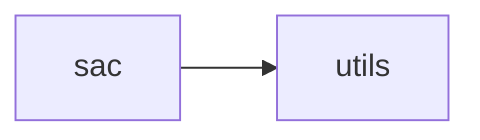

# Safe Rl Sac

[_Documentation generated by Documatic_](https://www.documatic.com)

<!---Documatic-section-Codebase Structure-start--->
## Codebase Structure

<!---Documatic-block-system_architecture-start--->

<!---Documatic-block-system_architecture-end--->

# #
<!---Documatic-section-Codebase Structure-end--->

<!---Documatic-section-safe_rl.sac.sac.sac-start--->
## safe_rl.sac.sac.sac

<!---Documatic-section-sac-start--->
<!---Documatic-block-safe_rl.sac.sac.sac-start--->
<details>
	<summary><code>safe_rl.sac.sac.sac</code> code snippet</summary>

```python
def sac(env_fn, actor_fn=mlp_actor, critic_fn=mlp_critic, ac_kwargs=dict(), seed=0, steps_per_epoch=1000, epochs=100, replay_size=int(1000000.0), gamma=0.99, polyak=0.995, lr=0.0001, batch_size=1024, local_start_steps=int(1000.0), max_ep_len=1000, logger_kwargs=dict(), save_freq=10, local_update_after=int(1000.0), update_freq=1, render=False, fixed_entropy_bonus=None, entropy_constraint=-1.0, fixed_cost_penalty=None, cost_constraint=None, cost_lim=None, reward_scale=1):
    use_costs = fixed_cost_penalty or cost_constraint or cost_lim
    logger = EpochLogger(**logger_kwargs)
    logger.save_config(locals())
    (env, test_env) = (env_fn(), env_fn())
    obs_dim = env.observation_space.shape[0]
    act_dim = env.action_space.shape[0]
    tf.set_random_seed(seed)
    np.random.seed(seed)
    env.seed(seed)
    test_env.seed(seed)
    act_limit = env.action_space.high[0]
    ac_kwargs['action_space'] = env.action_space
    (x_ph, a_ph, x2_ph, r_ph, d_ph, c_ph) = placeholders(obs_dim, act_dim, obs_dim, None, None, None)
    with tf.variable_scope('main'):
        (mu, pi, logp_pi) = actor_fn(x_ph, a_ph, **ac_kwargs)
        (qr1, qr1_pi) = critic_fn(x_ph, a_ph, pi, name='qr1', **ac_kwargs)
        (qr2, qr2_pi) = critic_fn(x_ph, a_ph, pi, name='qr2', **ac_kwargs)
        (qc, qc_pi) = critic_fn(x_ph, a_ph, pi, name='qc', **ac_kwargs)
    with tf.variable_scope('main', reuse=True):
        (_, pi2, logp_pi2) = actor_fn(x2_ph, a_ph, **ac_kwargs)
    with tf.variable_scope('target'):
        (_, qr1_pi_targ) = critic_fn(x2_ph, a_ph, pi2, name='qr1', **ac_kwargs)
        (_, qr2_pi_targ) = critic_fn(x2_ph, a_ph, pi2, name='qr2', **ac_kwargs)
        (_, qc_pi_targ) = critic_fn(x2_ph, a_ph, pi2, name='qc', **ac_kwargs)
    if fixed_entropy_bonus is None:
        with tf.variable_scope('entreg'):
            soft_alpha = tf.get_variable('soft_alpha', initializer=0.0, trainable=True, dtype=tf.float32)
        alpha = tf.nn.softplus(soft_alpha)
    else:
        alpha = tf.constant(fixed_entropy_bonus)
    log_alpha = tf.log(alpha)
    if use_costs:
        if fixed_cost_penalty is None:
            with tf.variable_scope('costpen'):
                soft_beta = tf.get_variable('soft_beta', initializer=0.0, trainable=True, dtype=tf.float32)
            beta = tf.nn.softplus(soft_beta)
            log_beta = tf.log(beta)
        else:
            beta = tf.constant(fixed_cost_penalty)
            log_beta = tf.log(beta)
    else:
        beta = 0.0
        print('Not using costs')
    replay_buffer = ReplayBuffer(obs_dim=obs_dim, act_dim=act_dim, size=replay_size)
    if proc_id() == 0:
        var_counts = tuple((count_vars(scope) for scope in ['main/pi', 'main/qr1', 'main/qr2', 'main/qc', 'main']))
        print('\nNumber of parameters: \t pi: %d, \t qr1: %d, \t qr2: %d, \t qc: %d, \t total: %d\n' % var_counts)
    min_q_pi = tf.minimum(qr1_pi, qr2_pi)
    min_q_pi_targ = tf.minimum(qr1_pi_targ, qr2_pi_targ)
    q_backup = tf.stop_gradient(r_ph + gamma * (1 - d_ph) * (min_q_pi_targ - alpha * logp_pi2))
    qc_backup = tf.stop_gradient(c_ph + gamma * (1 - d_ph) * qc_pi_targ)
    pi_loss = tf.reduce_mean(alpha * logp_pi - min_q_pi + beta * qc_pi)
    qr1_loss = 0.5 * tf.reduce_mean((q_backup - qr1) ** 2)
    qr2_loss = 0.5 * tf.reduce_mean((q_backup - qr2) ** 2)
    qc_loss = 0.5 * tf.reduce_mean((qc_backup - qc) ** 2)
    q_loss = qr1_loss + qr2_loss + qc_loss
    entropy_constraint *= act_dim
    pi_entropy = -tf.reduce_mean(logp_pi)
    alpha_loss = -alpha * (entropy_constraint - pi_entropy)
    print('using entropy constraint', entropy_constraint)
    if use_costs:
        if cost_constraint is None:
            cost_constraint = cost_lim * (1 - gamma ** max_ep_len) / (1 - gamma) / max_ep_len
        print('using cost constraint', cost_constraint)
        beta_loss = beta * (cost_constraint - qc)
    train_pi_op = MpiAdamOptimizer(learning_rate=lr).minimize(pi_loss, var_list=get_vars('main/pi'), name='train_pi')
    with tf.control_dependencies([train_pi_op]):
        train_q_op = MpiAdamOptimizer(learning_rate=lr).minimize(q_loss, var_list=get_vars('main/q'), name='train_q')
    if fixed_entropy_bonus is None:
        entreg_optimizer = MpiAdamOptimizer(learning_rate=lr)
        with tf.control_dependencies([train_q_op]):
            train_entreg_op = entreg_optimizer.minimize(alpha_loss, var_list=get_vars('entreg'))
    if use_costs and fixed_cost_penalty is None:
        costpen_optimizer = MpiAdamOptimizer(learning_rate=lr)
        with tf.control_dependencies([train_entreg_op]):
            train_costpen_op = costpen_optimizer.minimize(beta_loss, var_list=get_vars('costpen'))
    target_update = get_target_update('main', 'target', polyak)
    with tf.control_dependencies([train_pi_op]):
        with tf.control_dependencies([train_q_op]):
            grouped_update = tf.group([target_update])
    if fixed_entropy_bonus is None:
        grouped_update = tf.group([grouped_update, train_entreg_op])
    if use_costs and fixed_cost_penalty is None:
        grouped_update = tf.group([grouped_update, train_costpen_op])
    target_init = get_target_update('main', 'target', 0.0)
    sess = tf.Session()
    sess.run(tf.global_variables_initializer())
    sess.run(target_init)
    sess.run(sync_all_params())
    logger.setup_tf_saver(sess, inputs={'x': x_ph, 'a': a_ph}, outputs={'mu': mu, 'pi': pi, 'qr1': qr1, 'qr2': qr2, 'qc': qc})

    def get_action(o, deterministic=False):
        act_op = mu if deterministic else pi
        return sess.run(act_op, feed_dict={x_ph: o.reshape(1, -1)})[0]

    def test_agent(n=10):
        for j in range(n):
            (o, r, d, ep_ret, ep_cost, ep_len, ep_goals) = (test_env.reset(), 0, False, 0, 0, 0, 0)
            while not (d or ep_len == max_ep_len):
                (o, r, d, info) = test_env.step(get_action(o, True))
                if render and proc_id() == 0 and (j == 0):
                    test_env.render()
                ep_ret += r
                ep_cost += info.get('cost', 0)
                ep_len += 1
                ep_goals += 1 if info.get('goal_met', False) else 0
            logger.store(TestEpRet=ep_ret, TestEpCost=ep_cost, TestEpLen=ep_len, TestEpGoals=ep_goals)
    start_time = time.time()
    (o, r, d, ep_ret, ep_cost, ep_len, ep_goals) = (env.reset(), 0, False, 0, 0, 0, 0)
    total_steps = steps_per_epoch * epochs
    vars_to_get = dict(LossPi=pi_loss, LossQR1=qr1_loss, LossQR2=qr2_loss, LossQC=qc_loss, QR1Vals=qr1, QR2Vals=qr2, QCVals=qc, LogPi=logp_pi, PiEntropy=pi_entropy, Alpha=alpha, LogAlpha=log_alpha, LossAlpha=alpha_loss)
    if use_costs:
        vars_to_get.update(dict(Beta=beta, LogBeta=log_beta, LossBeta=beta_loss))
    print('starting training', proc_id())
    local_steps = 0
    local_steps_per_epoch = steps_per_epoch // num_procs()
    local_batch_size = batch_size // num_procs()
    epoch_start_time = time.time()
    for t in range(total_steps // num_procs()):
        '\n        Until local_start_steps have elapsed, randomly sample actions\n        from a uniform distribution for better exploration. Afterwards,\n        use the learned policy.\n        '
        if t > local_start_steps:
            a = get_action(o)
        else:
            a = env.action_space.sample()
        (o2, r, d, info) = env.step(a)
        r *= reward_scale
        c = info.get('cost', 0)
        ep_ret += r
        ep_cost += c
        ep_len += 1
        ep_goals += 1 if info.get('goal_met', False) else 0
        local_steps += 1
        d = False if ep_len == max_ep_len else d
        replay_buffer.store(o, a, r, o2, d, c)
        o = o2
        if d or ep_len == max_ep_len:
            logger.store(EpRet=ep_ret, EpCost=ep_cost, EpLen=ep_len, EpGoals=ep_goals)
            (o, r, d, ep_ret, ep_cost, ep_len, ep_goals) = (env.reset(), 0, False, 0, 0, 0, 0)
        if t > 0 and t % update_freq == 0:
            for j in range(update_freq):
                batch = replay_buffer.sample_batch(local_batch_size)
                feed_dict = {x_ph: batch['obs1'], x2_ph: batch['obs2'], a_ph: batch['acts'], r_ph: batch['rews'], c_ph: batch['costs'], d_ph: batch['done']}
                if t < local_update_after:
                    logger.store(**sess.run(vars_to_get, feed_dict))
                else:
                    (values, _) = sess.run([vars_to_get, grouped_update], feed_dict)
                    logger.store(**values)
        if t > 0 and t % local_steps_per_epoch == 0:
            epoch = t // local_steps_per_epoch
            if epoch % save_freq == 0 or epoch == epochs - 1:
                logger.save_state({'env': env}, None)
            test_start_time = time.time()
            test_agent()
            logger.store(TestTime=time.time() - test_start_time)
            logger.store(EpochTime=time.time() - epoch_start_time)
            epoch_start_time = time.time()
            logger.log_tabular('Epoch', epoch)
            logger.log_tabular('EpRet', with_min_and_max=True)
            logger.log_tabular('TestEpRet', with_min_and_max=True)
            logger.log_tabular('EpCost', with_min_and_max=True)
            logger.log_tabular('TestEpCost', with_min_and_max=True)
            logger.log_tabular('EpLen', average_only=True)
            logger.log_tabular('TestEpLen', average_only=True)
            logger.log_tabular('EpGoals', average_only=True)
            logger.log_tabular('TestEpGoals', average_only=True)
            logger.log_tabular('TotalEnvInteracts', mpi_sum(local_steps))
            logger.log_tabular('QR1Vals', with_min_and_max=True)
            logger.log_tabular('QR2Vals', with_min_and_max=True)
            logger.log_tabular('QCVals', with_min_and_max=True)
            logger.log_tabular('LogPi', with_min_and_max=True)
            logger.log_tabular('LossPi', average_only=True)
            logger.log_tabular('LossQR1', average_only=True)
            logger.log_tabular('LossQR2', average_only=True)
            logger.log_tabular('LossQC', average_only=True)
            logger.log_tabular('LossAlpha', average_only=True)
            logger.log_tabular('LogAlpha', average_only=True)
            logger.log_tabular('Alpha', average_only=True)
            if use_costs:
                logger.log_tabular('LossBeta', average_only=True)
                logger.log_tabular('LogBeta', average_only=True)
                logger.log_tabular('Beta', average_only=True)
            logger.log_tabular('PiEntropy', average_only=True)
            logger.log_tabular('TestTime', average_only=True)
            logger.log_tabular('EpochTime', average_only=True)
            logger.log_tabular('TotalTime', time.time() - start_time)
            logger.dump_tabular()
```
</details>
<!---Documatic-block-safe_rl.sac.sac.sac-end--->
<!---Documatic-section-sac-end--->

# #
<!---Documatic-section-safe_rl.sac.sac.sac-end--->

[_Documentation generated by Documatic_](https://www.documatic.com)